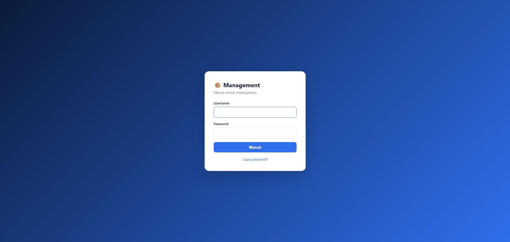
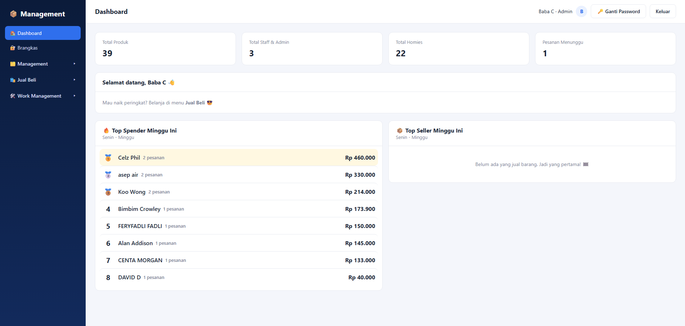
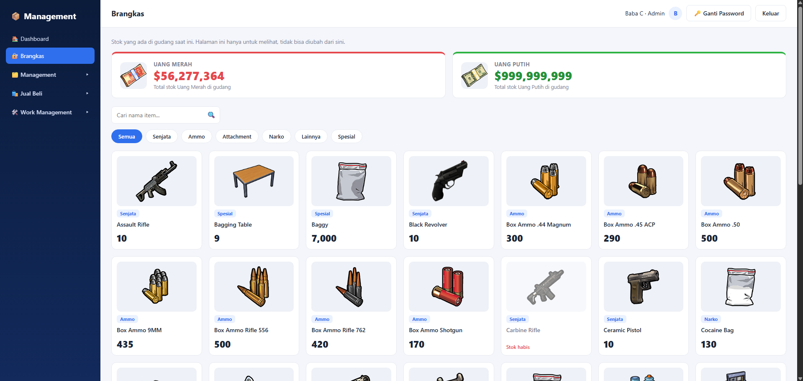
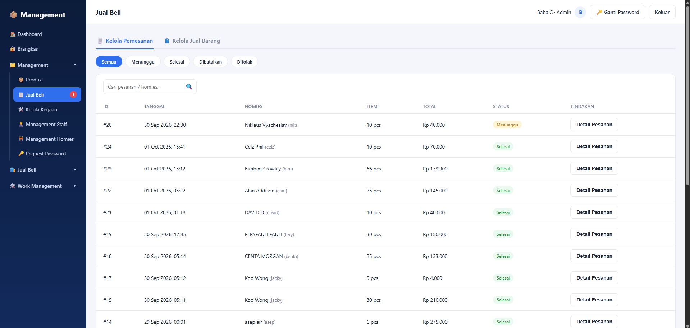
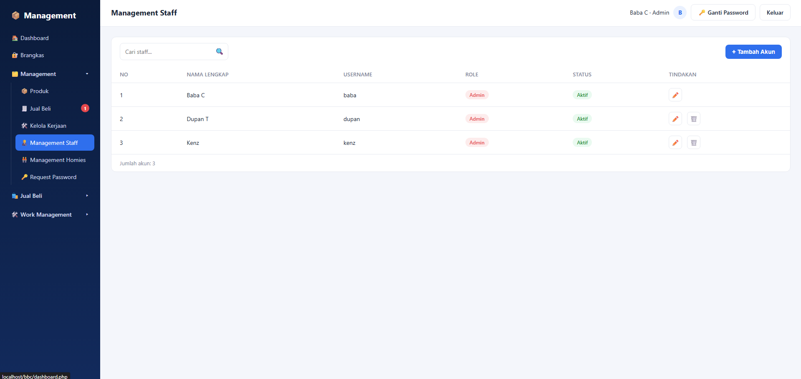
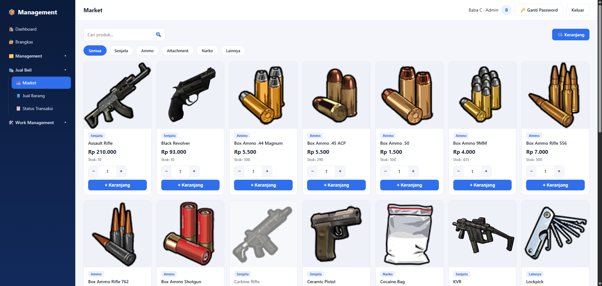
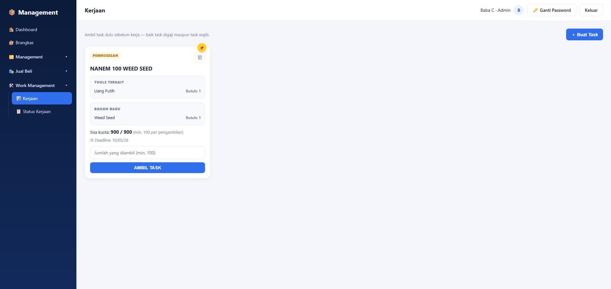

# Sistem Manajemen Toko & Gudang

Aplikasi web (PHP native + MySQL, tanpa framework) untuk mengelola stok produk (Senjata,
Ammo, Attachment, Narko, Spesial, Lainnya), akun Staff/Admin & Homies (member), Jual Beli
(belanja di Market + Homies jual balik barang ke toko lewat Jual Barang), Work Management,
dan Brangkas (lihat stok gudang) — lengkap dengan leaderboard Top Spender & Top Seller di
Dashboard.

## Struktur Folder

```
bbc/
├── config/
│   ├── db.php                         -> koneksi database + auto-seed akun admin default kalau tabel users kosong
│   ├── heriansyah_management.sql      -> database + tabel + data database
├── includes/
│   ├── auth.php                       -> session, require_login()/require_admin()/require_management(),
│   │                                      helper role, keranjang (cart), konstanta kategori/min qty, dsb
│   ├── header.php                     -> head + layout + topbar (dipakai semua halaman)
│   ├── sidebar.php                    -> menu sidebar (Dashboard, Brangkas, dropdown Management/Jual Beli/Work Management,
│   │                                      badge jumlah item yang masih menunggu diproses)
│   ├── footer.php                     -> penutup layout + include JS
│   └── work.php                       -> fungsi dan database helper untuk Work Management
├── staff/
│   ├── management_staff.php           -> (admin only) list akun admin/staff + form tambah akun
│   ├── edit_staff.php                 -> (admin only) edit akun (nama, role, status, reset password)
│   └── hapus_staff.php                -> (admin only) hapus akun
├── homies/
│   ├── management_homies.php          -> (admin & staff) list homies + form tambah homies (nama, no HP, Discord ID)
│   ├── edit_homies.php                -> (admin & staff) edit data homies
│   ├── hapus_homies.php               -> (admin & staff) hapus homies
│   └── request_password.php           -> (admin & staff) approve/tolak permintaan reset password dari homies
├── produk/
│   ├── produk.php                     -> (admin & staff) master data produk: nama, kategori, foto, stok,
│   │                                      harga beli & harga jual
│   ├── edit_produk.php                -> (admin & staff) edit produk (termasuk ganti foto)
│   └── hapus_produk.php               -> (admin & staff) hapus produk (foto ikut dihapus dari server)
├── brangkas/
│   └── brangkas.php                   -> (semua role) lihat stok gudang, read-only. Kartu "Uang Merah" & "Uang Putih"
│                                          (produk dengan nama itu) selalu tampil di atas dan tidak ikut di daftar
│                                          item / filter kategori
├── jual_beli/                         -> semua halaman menu "Jual Beli" (sisi homies & sisi management)
│   ├── market.php                     -> (semua role) katalog produk + tambah ke keranjang (filter kategori,
│   │                                      kategori Spesial tidak ditampilkan)
│   ├── keranjang.php                  -> (semua role) keranjang belanja, sinkron otomatis ke stok terbaru,
│   │                                      checkout jadi Pesanan
│   ├── jual_barang.php                -> (semua role) Homies jual barang balik ke toko dari daftar
│   │                                      whitelist (diatur admin/staff), stok toko baru bertambah saat di-ACC
│   ├── keranjang_jual_barang.php      -> keranjang pengajuan Jual Barang (session)
│   ├── status_transaksi.php           -> (semua role) tab "Status Pesanan": riwayat pesanan sendiri + tombol
│   │                                      batalkan (khusus status "menunggu")
│   ├── status_jual_barang.php         -> (semua role) tab "Status Jual Barang": status pengajuan Jual Barang sendiri
│   ├── kelola_pemesanan.php           -> (admin & staff) Management > Jual Beli, tab "Kelola Pemesanan":
│   │                                      daftar semua pesanan + filter status
│   ├── proses_pesanan.php             -> (admin & staff) tandai pesanan Selesai / Tolak (tolak = stok balik)
│   ├── kelola_jual_barang.php         -> (admin & staff) Management > Jual Beli, tab "Kelola Jual Barang":
│   │                                      ACC / Tolak pengajuan Jual Barang
│   └── proses_jual_barang.php         -> proses aksi ACC/Tolak pengajuan Jual Barang
├── work_management/
│   ├── kerjaan.php                    -> (semua role) daftar task + Buat Task + ambil task
│   ├── kelola_kerjaan.php             -> (admin & staff) kelola pengajuan pengerjaan task
│   ├── status_kerjaan.php             -> (semua role) status dan detail task yang pernah diambil
│   └── proses_kerjaan.php             -> proses ACC, Tolak, dan Selesai task
├── assets/
│   ├── css/style.css                  -> SATU file CSS untuk semua halaman
│   ├── js/script.js                   -> interaksi sidebar, modal, search-select, live search tabel, dsb
│   └── uploads/                       -> folder foto produk hasil upload
├── cgi-bin/.htaccess                  -> Options -Indexes (proteksi listing folder)
├── index.php                          -> halaman login
├── logout.php                         -> proses logout
├── lupa_password.php                  -> halaman publik: homies kirim permintaan reset password
├── ganti_password.php                 -> ganti password akun sendiri (juga dipakai saat wajib ganti
│                                          password setelah direset admin/staff)
└── dashboard.php                      -> halaman setelah login (statistik + leaderboard Top Spender & Top Seller)
```

## Cara Menjalankan (XAMPP/Laragon)

1. Copy folder `bbc` ke `htdocs` (XAMPP) atau `www` (Laragon).
2. Buka phpMyAdmin, import file `config/heriansyah_management.sql`.
3. Cek `config/db.php`, sesuaikan `$DB_HOST` / `$DB_USER` / `$DB_PASS` / `$DB_NAME` kalau perlu.
4. Jalankan Apache + MySQL, lalu buka `http://localhost/bbc/index.php`.
5. Kalau tabel `users` masih kosong, akun **admin / admin123** otomatis dibuat lewat `db.php`
   saat pertama kali halaman dibuka (hash password dibuat via `password_hash()` PHP).

Butuh **PHP 7.0+** (pakai null coalescing `??`) dan ekstensi **mysqli** aktif — default sudah
aktif di XAMPP/Laragon versi mana pun.

## Role & Akun

| Role   | Akses                                                                                      |
|--------|---------------------------------------------------------------------------------------------|
| Admin  | Semua fitur, termasuk Management Staff (khusus admin)                                       |
| Staff  | Semua fitur Management kecuali Management Staff                                             |
| Homies | Dashboard, Brangkas, Jual Beli (Market/Jual Barang/Status Transaksi), Work Management      |

Akun default hasil auto-seed: `admin` / `admin123`. Akun staff & homies dibuat lewat
Management Staff / Management Homies setelah login.

## Fitur

- **Login & session**: hanya bisa masuk ke halaman manapun setelah login (`require_login()`);
  belum login otomatis diarahkan ke `index.php`. Ada halaman **Lupa Password** untuk homies
  ajukan reset (disetujui admin/staff lewat **Request Password**, password sementara `123`
  lalu wajib diganti saat login berikutnya lewat `ganti_password.php`).
- **3 Role**: admin, staff & homies, disimpan di kolom `role` tabel `users`.
- **Dashboard**: statistik Total Produk/Staff/Homies/Pesanan Menunggu (khusus admin & staff)
  serta leaderboard **Top Spender** (total belanja pesanan selesai) dan **Top Seller**
  (total barang yang berhasil dijual lewat Jual Barang), dihitung per minggu berjalan.
- **Management Staff** (khusus admin): tambah, edit, hapus akun admin/staff, reset password,
  ubah status aktif/nonaktif.
- **Management Homies** (admin & staff): tambah/edit/hapus data homies (nama, username,
  password, no HP, Discord ID).
- **Produk** (admin & staff, master data): nama, kategori (Senjata/Ammo/Attachment/Narko/
  Lainnya/Spesial), foto (upload jpg/jpeg/png/webp), stok, harga beli & harga jual.
- **Brangkas** (semua role, read-only): lihat stok gudang. Total **Uang Merah** & **Uang Putih**
  tampil sebagai kartu di atas (diambil dari produk bernama persis itu), lalu daftar semua item
  dengan pencarian + filter kategori. Uang Merah/Putih tidak muncul lagi di daftar.
- **Jual Beli** (grup menu untuk semua role): **Market** (katalog produk, kategori Spesial
  disembunyikan) → Keranjang (auto sinkron ke stok terbaru) → checkout jadi **Pesanan**; lalu
  **Jual Barang** (homies jual barang ke toko, hanya produk yang di-**whitelist** admin/staff;
  stok toko baru bertambah saat di-**ACC**, tanpa tahap lapor hasil); dan **Status Transaksi**
  dengan 2 tab: Status Pesanan (bisa batalkan selama "menunggu") & Status Jual Barang.
  Admin/staff mengelolanya di **Management > Jual Beli** dengan 2 tab: **Kelola Pemesanan**
  (Selesai/Tolak, tolak = stok dikembalikan) & **Kelola Jual Barang** (ACC/Tolak).
- **Work Management**: **Buat Task** hanya tersedia di **Work Management > Kerjaan**.
  Task memiliki tipe **Penjualan** atau **Pemrosesan**, jumlah tersedia, minimal ambil,
  dan deadline berupa tanggal dengan format **MM/DD/YY** tanpa jam.
  Pada tipe **Penjualan**, produk yang digunakan berasal dari kategori Narko.
  Pada tipe **Pemrosesan**, terdapat **Tools Terkait** dan **Bahan Baku** dari kategori
  Spesial, keduanya dapat dicari saat memilih produk. **Kelola Kerjaan** digunakan untuk
  memproses pengajuan task (ACC/Tolak/Selesai), bukan untuk membuat task.
- **Ganti Password**: verifikasi password lama (kecuali mode wajib ganti), simpan password baru
  (di-hash `password_hash()`), tidak boleh sama dengan password lama.

## Teknologi

- PHP native (tanpa framework) + `mysqli` (prepared statements di semua query yang menerima
  input pengguna), transaksi (`mysqli_begin_transaction`) untuk aksi yang mengubah stok.
- MySQL / MariaDB.
- Vanilla JS (tanpa library) untuk interaksi UI: toggle sidebar, modal konfirmasi hapus,
  live search tabel, dan komponen search-select.
- 1 file CSS (`assets/css/style.css`) untuk seluruh halaman, tanpa CSS framework.

### 📄 Tampilan 1


### 📄 Tampilan 2


### 📄 Tampilan 3


### 📄 Tampilan 4


### 📄 Tampilan 5


### 📄 Tampilan 6


### 📄 Tampilan 7


### 📄 Tampilan 8

